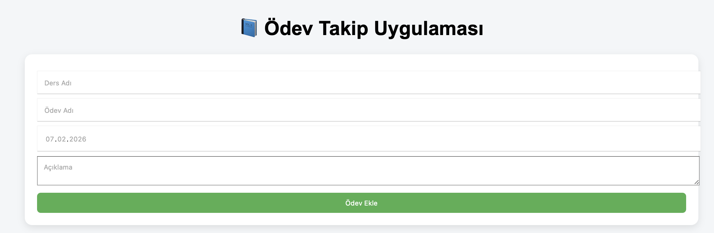
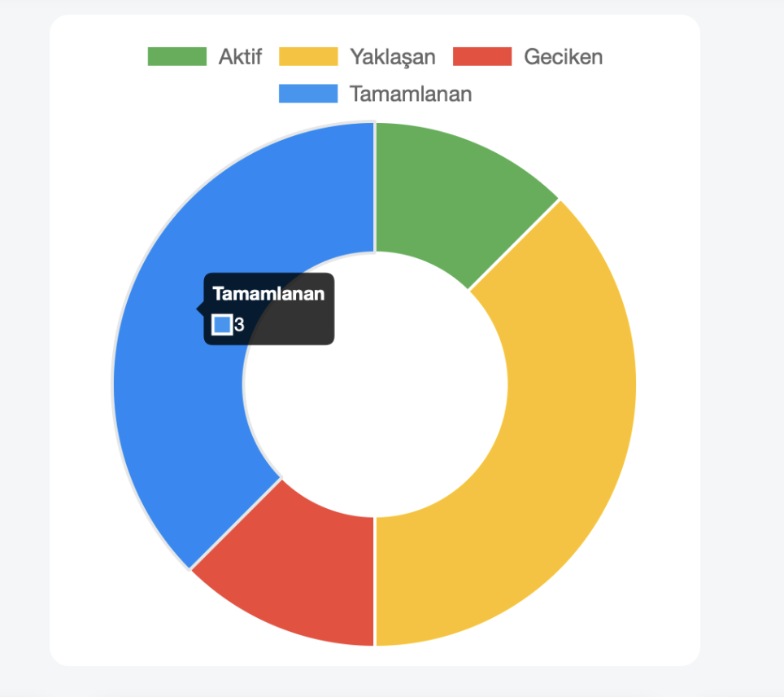
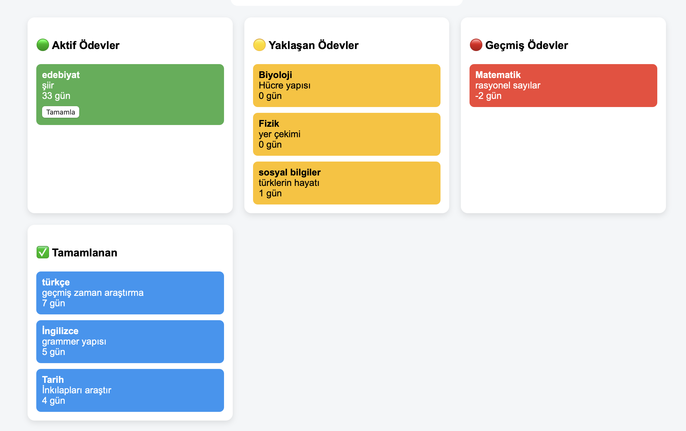

# 📘 Ödev Takip Uygulaması (Homework Tracking App)

Ödev Takip Uygulaması, öğrencilerin derslerine ait ödevlerini düzenli bir şekilde takip edebilmesi amacıyla geliştirilmiş web tabanlı bir uygulamadır.  
Uygulama; ödevlerin teslim tarihlerini görselleştirir, yaklaşan ve geciken ödevleri ayırt eder ve öğrencinin çalışma planını kolaylaştırır.

---

## 🎯 Projenin Amacı

- Öğrencilerin ödevlerini kaçırmamasını sağlamak  
- Teslim tarihi yaklaşan ve geciken ödevleri görsel olarak belirtmek  
- Ödev durumlarını kategorilere ayırarak daha anlaşılır hale getirmek  
- Ödev yükünü grafiksel olarak sunmak  

---

## 🚀 Özellikler

- Ders adı, ödev adı, teslim tarihi ve açıklama bilgileri ile ödev ekleme  
- Ödevleri **Aktif**, **Yaklaşan**, **Geçmiş (Geciken)** ve **Tamamlanan** olarak sınıflandırma  
- Teslim tarihine göre otomatik durum belirleme  
- Geciken ödevleri kırmızı, yaklaşan ödevleri uyarı rengiyle gösterme  
- Grafik (Chart.js) ile ödev durumlarının görselleştirilmesi  
- Verilerin tarayıcıda **localStorage** ile saklanması  
- Hatalı veya eksik tarih girişlerinde NaN hatasını önleyen güvenli kontrol  

---

## 📸 Ekran Görüntüleri

### Ders Ekleme Paneli
<p align="center">
  
</p>

### Grafik Detayı
<p align="center">
  
</p>

### Ödev Takip Paneli

<p align="center">
  
</p>

---

## 🛠 Kullanılan Teknolojiler

- **HTML5** – Sayfa yapısı  
- **CSS3** – Modern ve kullanıcı dostu arayüz  
- **JavaScript (Vanilla JS)** – Uygulama mantığı  
- **Chart.js** – Grafik oluşturma  
- **LocalStorage** – Kalıcı veri saklama  

---

## 📂 Proje Yapısı

homework_tracking/
│
├── index.html
└── README.md

---

## ▶️ Kurulum ve Çalıştırma

1. Projeyi klonlayın:
   ```bash
   git clone https://github.com/sudesgrc/homework_tracking.git
2. Proje klasörüne girin:
   ```bash
   cd homework_tracking
3. index.html dosyasını bir tarayıcıda açın.

Uygulama herhangi bir sunucuya ihtiyaç duymaz.
